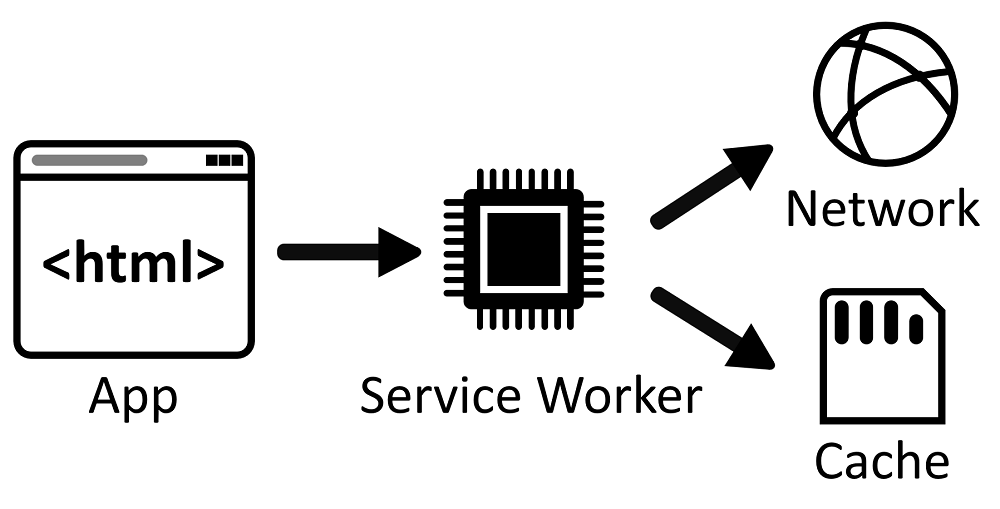
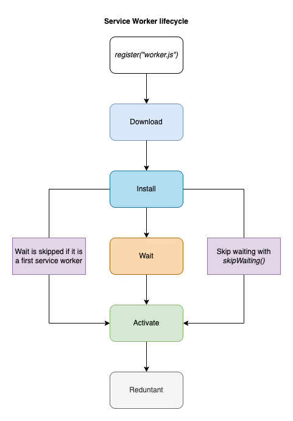

# What is a service worker 
    Service workers are scripts that your browser runs in the background, separate from a web page, allowing them to support features like offline functionality, push notifications, and background content updating. They act as intermediaries between the the browser, and the network. Or a proxy between the network and the browser.

[demo](https://googlechrome.github.io/samples/service-worker/basic/)

## Lifecycle
1. Download and parse
2. Installing
3. Installing/Waiting
4. Activate
5. Activated
6. Redundant

## Features:
1. Used to cache resources => caching makes a page load super fast regardless of connectivity
2. Offline applications - Applications can be made to work offline regardless of network state

## Common problems
- Service workers require HTTPS, so they can be hard to test locally (use chrome).
- They can easily cause frustrating cache related bugs during development. Use incognito browser.
- With CRA’s service worker strategy, new updates are only available after n+1 page loads because index.html is cached
- multiple versions of your app running at once (multiple tabs problem)
- Not all browsers support service workers

## Demo code:
1. CACHE_NAME: This is a constant representing the name of the cache. It's used to identify a specific cache storage. In this case, it's set to 'my-cache-v1'.

2. urlsToCache: This is an array containing the URLs of resources that should be cached when the service worker is installed. Initially, it includes only the root URL '/'. You can uncomment and add more URLs like stylesheets and scripts if needed.

3. addEventListener('install'): This event is fired when the service worker is first installed. Inside the event listener, it opens the cache identified by CACHE_NAME and adds the URLs specified in urlsToCache to the cache using cache.addAll().

4. addEventListener('fetch'): This event is fired whenever the registered service worker receives a fetch event, i.e., whenever the browser requests a resource (like HTML, CSS, JavaScript, images, etc.). Inside the event listener, it intercepts the fetch request, checks if the requested resource is already in the cache (caches.match(event.request)). If it's in the cache, it returns the cached response. If not, it makes a network request (fetch(event.request)), then checks if the response is valid (status 200 and of type 'basic'), caches it, and finally returns the response to the page.

5. event.waitUntil(): This method tells the browser that the event will not be considered completed until the promise passed to waitUntil() is resolved. It's used to ensure that the service worker doesn't terminate before the cache is opened and populated during installation.

6. response.clone(): This method is used to create a clone of the response object. This is necessary because the response object is a stream that can only be consumed once. By cloning it, you can both cache the response and return it to the page without consuming the original stream.