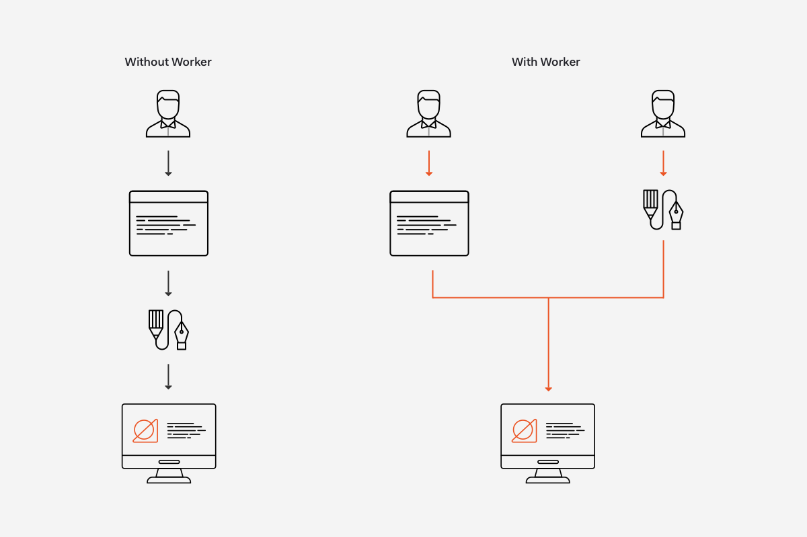

# What is a web worker
A web worker is a JavaScript script executed from an HTML page, which runs in the background, independently of other scripts, without affecting the performance of the page. Web workers are designed to perform tasks that are computationally intensive, time-consuming, or that require a lot of processing power, such as data processing, image manipulation, or complex calculations.

Web workers operate in a separate thread from the main JavaScript execution thread, allowing them to perform tasks concurrently without blocking the main user interface thread. This enables web applications to remain responsive and interactive even when performing heavy tasks.

There are two main types of web workers:

1. **Dedicated Workers:** These workers are dedicated to a single script file and can communicate with the main thread using the `postMessage()` method.

2. **Shared Workers:** These workers are shared among multiple scripts and web pages within the same origin (domain), allowing communication between multiple browsing contexts. Basically, multiple scripts communicating with each other, and called shared worker.

Web workers are commonly used in modern web development to improve the responsiveness and performance of web applications, especially those dealing with large datasets or complex operations. However, it's important to note that web workers have limitations, such as restrictions on accessing the DOM directly, which helps ensure thread safety.

## Use Cases:
1. Heavy Computation - data processing, encryption, decryption, or complex mathematical calculations
2. Parallel Processing - allows multiple tasks to be executed simultaneously
3. Background Tasks - logging, analytics, or prefetching resources
4. Offline Operations - caching resources, syncing data, or handling synchronization conflicts

## Issues
1. Communication Overhead: Since web workers run in separate threads, communication between the main thread and worker threads involves message passing through the postMessage() method. This introduces overhead, especially for large data transfers, and developers need to carefully manage communication to avoid performance bottlenecks.

2. Limited Scope: Web workers have limited access to the global scope compared to the main thread. For example, they cannot directly access the DOM or interact with the user interface. While this restriction ensures thread safety, it also means that developers need to carefully design their applications to work within these limitations.

3. No Access to UI: Since web workers cannot access the DOM directly, they cannot manipulate the user interface or respond to user events. This makes them unsuitable for tasks that require direct interaction with the UI, such as handling user input or updating UI elements in real time.

4. Browser Support: While web workers are supported in most modern browsers, there may still be compatibility issues with older browsers or certain mobile devices. Developers need to consider browser support when using web workers in their applications and provide fallbacks or alternative solutions where necessary.

5. Debugging: Debugging web workers can be more challenging compared to debugging code running in the main thread. Since they run in separate threads, debugging tools may not provide as much visibility into their execution context, making it harder to diagnose and fix issues.

6. Resource Consumption: While web workers can improve performance by offloading heavy tasks from the main thread, they also consume additional system resources. Developers need to be mindful of resource usage, especially on devices with limited processing power or memory, to ensure that web workers do not degrade overall system performance.

## Demo code
